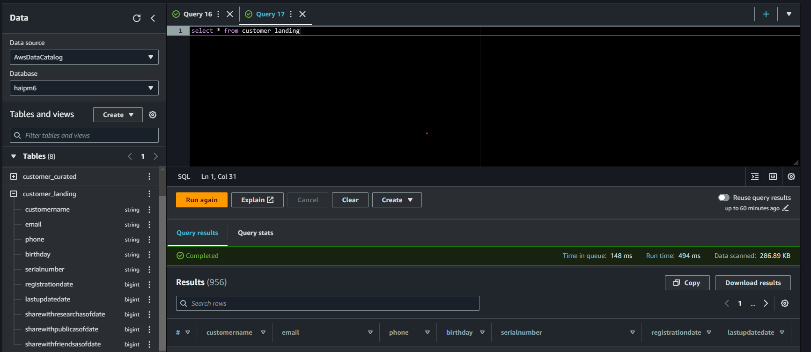
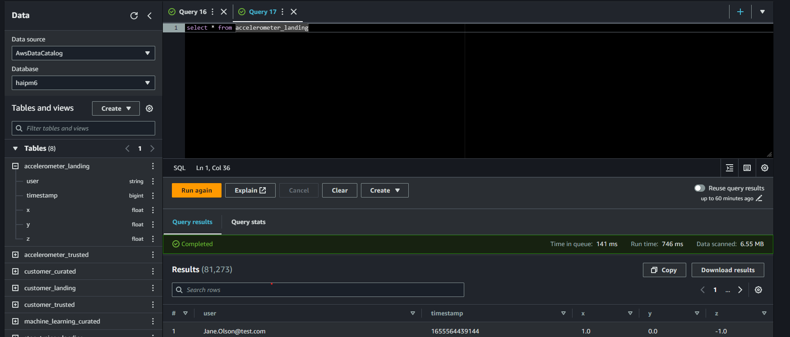
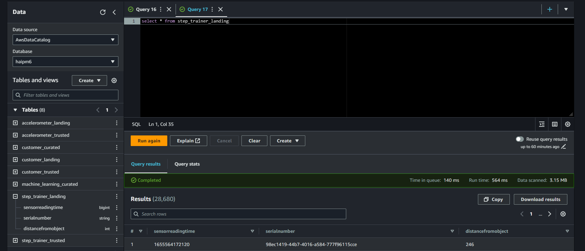
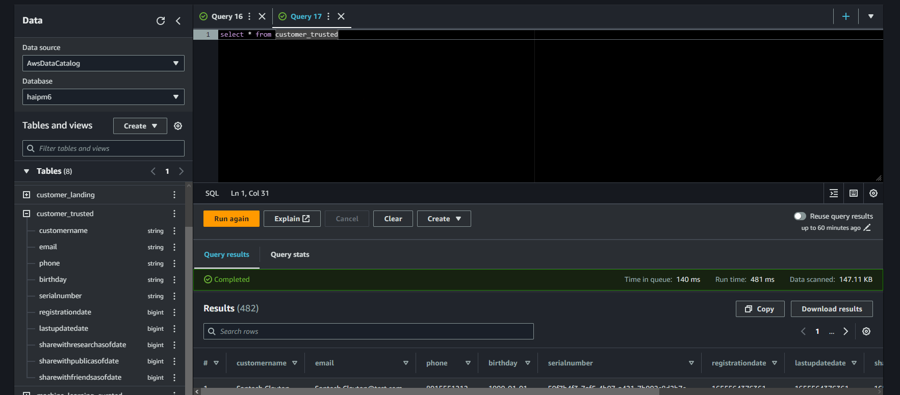
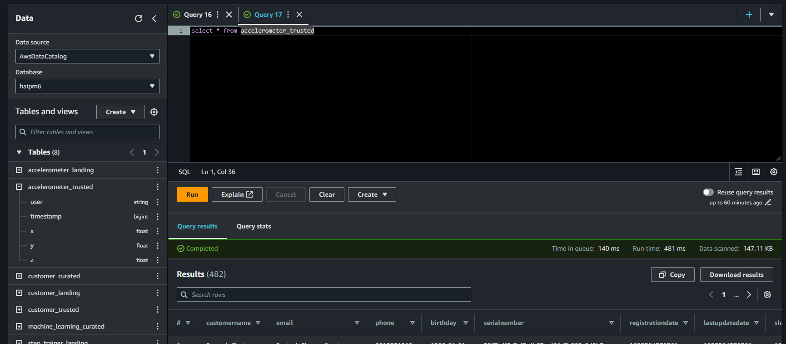
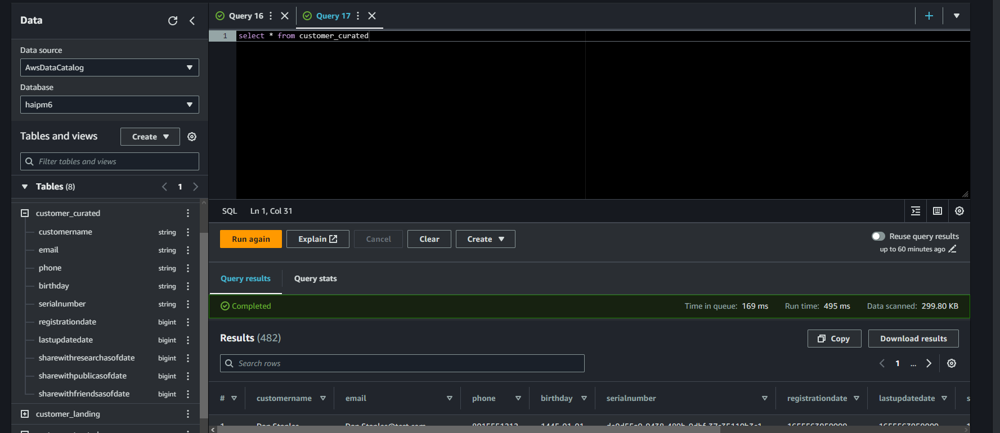
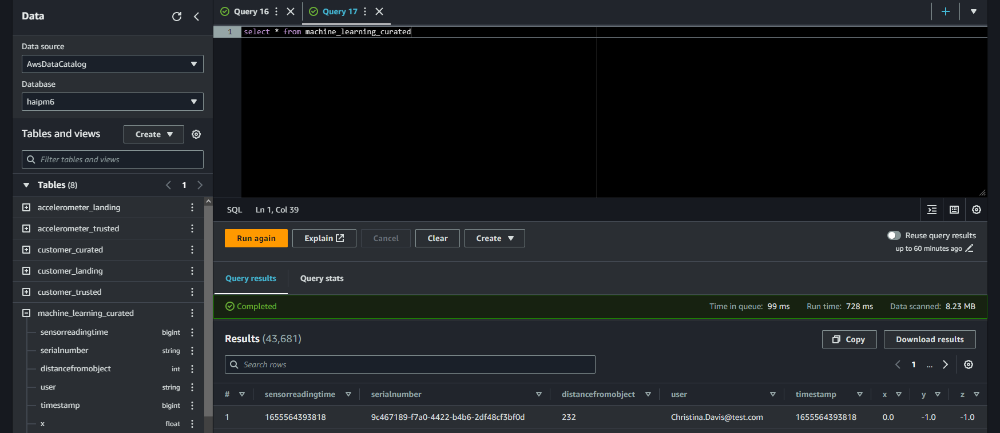

# STEDI-Human-Balance-Analytics
STEDI Human Balance Analytics from UDACITY

Using AWS Glue, AWS S3, Python, and Spark, create or generate Python scripts to build a lakehouse solution in AWS that satisfies these requirements from the STEDI data scientists. Project required from AWS Data Engineering nanodegree on Udacity.
---
## Data Table

To simulate the data coming from the various sources, you will need to  create your own S3 directories for  customer_landing,  step_trainer_landing, and accelerometer_landing, and copy the data folder there as a starting point.

### **1. Customer Records**

Contains the following fields:

- serialnumber
- sharewithpublicasofdate
- birthday
- registrationdate
- sharewithresearchasofdate
- customername
- email
- lastupdatedate
- phone
- sharewithfriendsasofdate

### **2. Step Trainer Records (data from the motion sensor):**

Contains the following fields:

- sensorReadingTime
- serialNumber
- distanceFromObject

### **3. Accelerometer Records (from the mobile app):**

Contains the following fields:

- timeStamp
- user
- x
- y
- z
---

## Implementation

Landing Zone

> In the store accelerometer/landing, customer/landing, step_trainer/landing data in AWS S3 bucket.
> create table from s3 bucket data

1- Customer Landing Table:

2- Accelerometer Landing Table: 

3- Step Trainer Landing Table: 

Trusted Zone

>Created AWS Glue jobs to make transofrmations on the data have stored in the landing zones.

**Glue job scripts**

[1. customer_landing_to_trusted.py](Glue_script/customer_landing_to_trusted.py) - This script transfers customer data from the 'landing' to 'trusted' zones. It filters for customers who have agreed to share data with researchers, customer_landing_to_trusted.py has a node that drops rows that do not have data in the sharedWithResearchAsOfDate column.

■result

[2. Accelerometer_Trusted_Zone.py](Glue_script/Accelerometer_Trusted_Zone.py) - This script transfers accelerometer data from the 'landing' to 'trusted' zones. Using a join on customer_trusted and accelerometer_landing,  filters for Accelerometer readings from customers who have agreed to share data with researchers, The produced table have only columns from the accelerometer table.

■result

[3. step_trainer_landing_to_trusted.py](step_trainer_landing_to_trusted.py) - has a node that inner joins the step_trainer_landing data with the customer_curated data by serial numbers.

■result

Curated Zone

> Created AWS Glue jobs to make further transformations, to meet the specific needs of a particular analysis.

**Glue job scripts**

[customer_trusted_to_curated.py](customer_trusted_to_curated.py) - has a node that inner joins the customer_trusted data with the accelerometer_trusted data by emails. The produced table should have only columns from the customer tab.

■result

[Trainer_trusted_to_curated.py](Trainer_trusted_to_curated.py): has a node that inner joins the step_trainer_trusted data with the accelerometer_trusted data by sensor reading time and timestamps.

■result

